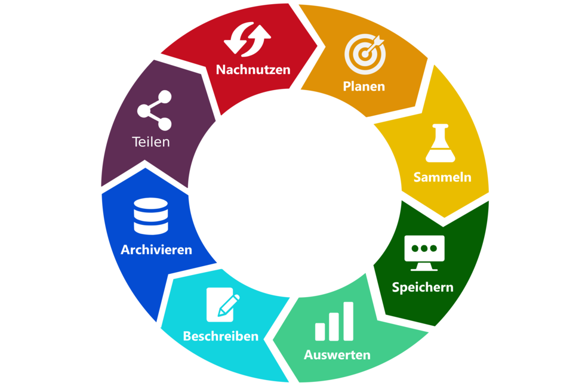
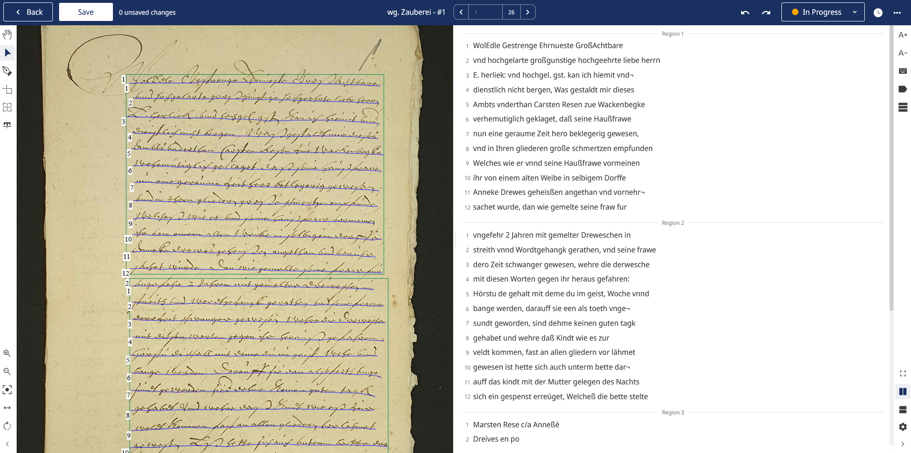
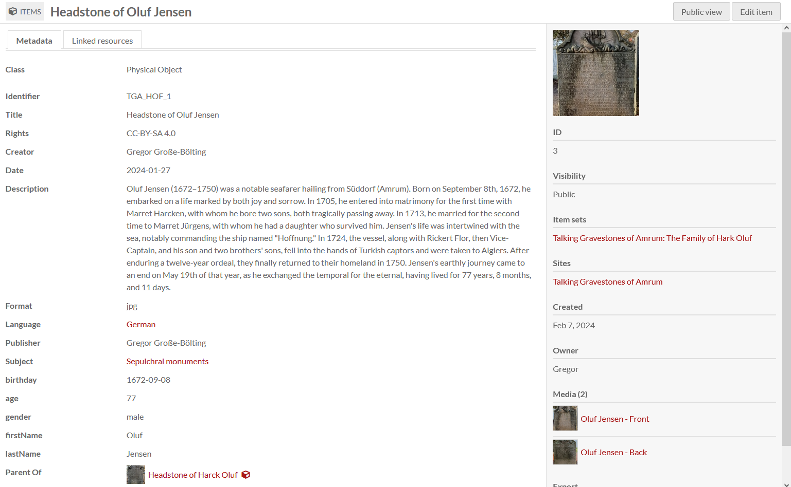
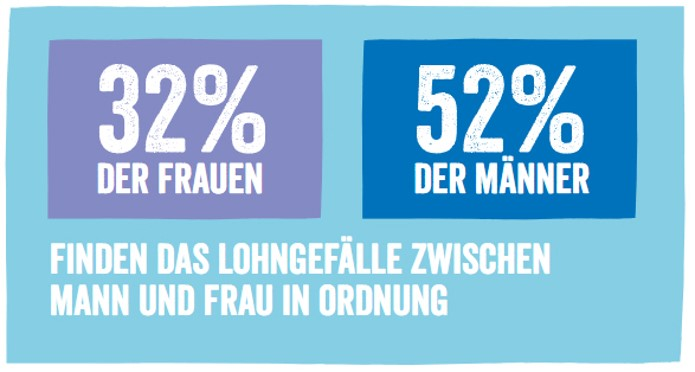
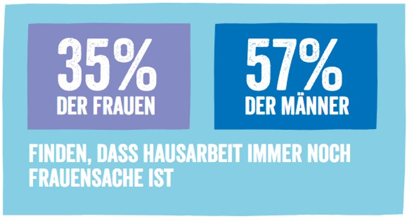

<!--

author: Swantje Piotrowski, Gregor Große-Bölting
email:  ggb@informatik.uni-kiel.de
version: 0.1
language: en
narrator: UK English Female

-->

# Projektseminar zur Geschichte der Neuzeit: Frauengeschichte(n) im 20. Jahrhundert digital erschließen

**Dozierende:**

* Dr. Swantje Piotrowski, M.A.
* Dr. Gregor Große-Bölting, M.A., M.A.

**Zeit und Raum:** Do 10:15 - 11:45, UB Kiel, DLL

**Inhalt:**

Die begrenzte Verfügbarkeit von Quellen, bestehende Geschlechterstereotype, Vorurteile und fehlende “Role Models” sind nur einige der Herausforderungen, denen sich die Frauen- und Geschlechtergeschichte seit jeher stellen muss. Digitale Medien beeinflussen die Art und Weise, wie wir Geschichte erzählen, erleben, verbreiten und erarbeiten. Digitale Plattformen, Blogs, Foren und Social-Media-Kampagnen können ein neues Bewusstsein für geschlechtsspezifische Perspektiven schaffen. Aufbauend auf einem Seminar im Sommersemester 2024, das sich mit verschiedenen Frauenbiografien der Frühen Neuzeit beschäftigte, widmen sich die beiden folgenden Projektseminare im Wintersemester 2024/25 und Sommersemester 2025 der Erforschung der Frauen- und Geschlechtergeschichte im 20. Jahrhundert. Im Fokus der kommenden Seminare stehen Wissenschaftlerinnen, deren soziale, familiäre und wissenschaftliche Netzwerke näher untersucht werden sollen. Ziel ist es, tiefere Einblicke in die Lebenswelten und beruflichen Verbindungen dieser Frauen zu gewinnen. In der forschungsorientierten Lehrveranstaltung sammeln, strukturieren und interpretieren Studierende Informationen aus historischen Quellen. Die Lehrveranstaltung ist als (digitale) Forschungswerkstatt konzipiert: Der Arbeitsprozess wird gemeinsam entwickelt, umgesetzt und diskutiert. Durch die Forschungspraxis werden Studierende mit digitalen Grundkenntnissen sowie mit gängigen Methoden für die digitale Bearbeitung und Auswertung von Quellen vertraut gemacht. Die Lehrveranstaltung bildet so eine solide Grundlage für die kritische Anwendung solcher Verfahren im weiteren Studium und in wissensvermittelnden Berufsfeldern. Als Prüfungsleistung gilt die Erstellung eines Reflexionsberichts über den Arbeits- und Forschungsprozess sowie die Visualisierung der Rechercheleistung. 

**Lernziele:**

* Transkription von (handschriftlichen und) gedruckten Dokumenten
* fachwissenschaftliche Einordnung der Quellen
* vertiefte fachwissenschaftliche Kenntnisse (Frauen- und Geschlechtergeschichte, Biographiegeschichte, Public History, Sammlungsgeschichte)
* Methodenkompetenz im Bereich der Digital Humanities
* Visualisierung und Präsentation der Forschungsergebnisse
* Erfahrungen in den Berufs- und Praxisfeldern Wissensvermittlung
* eigenständiges und selbstorganisiertes Arbeiten

**Weiterführende Links und Literatur:**

* Link zum **DDF:** https://www.digitales-deutsches-frauenarchiv.de
* Link zum **akhfg:** https://akhfg.de
* Link zum **Center for the History of Women Philosophers and Scientists**: https://historyofwomenphilosophers.org/

## Allgemeines und erste Sitzung

### Semesterplan

**Termine:**

| Datum  | Thema/Inhalt                                      | 
|--------|---------------------------------------------------|
| 24.10. | Begrüßung, Organisatorisches, Erwartungen, Fragen |           
| 31.10. | **FEIERTAG - KEIN SEMINAR**                        | 
| 07.11. | *wg. Krankheit ausgefallen* | 
| 14.11. | Inhaltliche Einführung in den Themenbereich "Frauen- und Geschlechtergeschichte"; **Planen:** Diskussion von potenziellen Forschungsthemen |
| 21.11. | (Selbststudium) **Sammeln:** Einführung in verschiedene Quellenarten zur Erforschung von Frauenbiographien / Transkribus /  Archivinformationssystem Arcinsys |
| 28.11. | Planung und Sammeln cont'd: Nachbesprechung und -aufbereitung der Selbstlernergebnisse |
| 05.12. | **Speichern:** Besuch im Landesarchiv (mit dem Leiter des Universitätarchivs Dr. Jörg Rathjen) |
| 12.12. | (Doppelsitzung) **Auswerten:** Gemeinsame Arbeitssitzung / Analyse der gesammelten Quellen und **Beschreiben:** Metadatenstandards: Welche gibt es und ihr Sinn und Zweck |
| 19.12. | (Selbststudium) |
| 09.01. | (Doppelsitzung) **Archivieren:** Anwendung von Metadatenstandards auf Forschungsergebnisse und **Teilen:** Entwicklung von Forschungsfragen / Beispiele für Online-Präsentationen / Präsentation der Quellen |
| 16.01. | (Selbststudium)  |
| 23.01. | (Doppelsitzung) **Teilen:** Omeka S und "How to" zur Präsentation der Quellen, **Auswerten** und **Beschreiben:** gemeinsame Arbeitssitzung / Recherche / Feedback und Beratung zur Weiterentwicklung der Forschungsprojekte |
| 30.01. | Arbeitssitzung: offen für Rückfragen, Hilfestellungen etc. |
| 06.02. | Präsentation der (Zwischen-)Ergebnisse, Evaluation |

### Forschungs(daten)zyklus

#### ScanTent

#### Transkribus

#### Omeka: Datenerfassung

#### Omeka: Präsentation der Ergebnisse

[Projekte aus dem zurückliegenden Sommersemester](https://projekt03.omeka-s.ub.uni-kiel.de/) (aus dem Uni-Netz erreichbar)

### Prüfungsleistung

Produkt zur Darstellung der ausgewählten Quellen inkl. Reflexion zur frauengeschichtlichen Bedeutung.

Details folgen im Laufe des Semesters.

### "Regierungserklärung"

1. Diese Veranstaltung ist eine Forschungswerkstatt: Wir setzen neue Methoden und Software ein. Seien Sie also nachsichtig mit uns und mit sich selbst, wenn mal etwas nicht funktioniert wie geplant. Lassen Sie uns zeitnah wissen, wenn Sie Probleme haben, dann findet sich für alles eine Lösung!
2. Weil es sich um eine Forschungswerkstatt handelt, erwarten wir Eigenengagement und Eigeninitiative für das Thema: Sie werden an verschiedenen Stellen selbst recherchieren, arbeiten und experementieren müssen. Im Gegenzug unterstützen wir Sie, wo wir können.
3. Es kann sein, dass Sie in Ihren Quellen wenig oder gar keine biographischen Details finden: Das ist auch ein Ergebnis, dessen Dokumentation einen Wert hat!
4. Der Seminarplan ist "im Fluss".

### Aufgabe zur nächsten Woche

Bitte lesen Sie zur nächsten Woche die folgenden Artikel:

* Leonie Schöler: Beklaute Frauen: Denkerinnen, Forscherinnen, Pionierinnen: Die unsichtbaren Heldinnen der Geschichte. München 2024, Einleitung, S. 11-23 (im Olat-Ordner).
* [Kirsten Heinsohn](https://docupedia.de/zg/Docupedia:Kirsten_Heinsohn "Docupedia:Kirsten Heinsohn"), [Claudia Kemper](https://docupedia.de/zg/Docupedia:Claudia_Kemper "Docupedia:Claudia Kemper"), Geschlechtergeschichte, in: Docupedia-Zeitgeschichte, 04.12.2012, [http://docupedia.de/zg/heinsohn_kemper_geschlechtergeschichte_v1_de_2012](https://docupedia.de/zg/Docupedia:Kirsten_Heinsohn)
* (und darauf aufbauend:) [Sylvia Schraut: Mädchen- und Frauenbildung, Digitales Deutsches Frauenarchiv](https://www.digitales-deutsches-frauenarchiv.de/themen/maedchen-und-frauenbildung)
* Ute Gerhard, Frauenbewegung, S. 188-217 (im Olat-Ordner).

## Sitzung am 07.11.2024 
(wegen Krankheit entfallen)

## Sitzung am 14.11.2024

### Gruppenarbeit Mind-Map

1. Bitte notieren Sie die zentralen Themen, Ereignisse und Theorien aus dem Text von Ute Gerhard zur "Frauenbewegung" und Kirsten Heinsohn, Claudia Kemper zur "Geschlechtergeschichte", die Sie als wichtig erachten. Dabei sollten Sie die grundlegenden Begriffe "Frauenbewegung" sowie "Frauen- und Geschlechtergeschichte" zusammenführen als auch voneinander abgrenzen.

2. Reflektieren Sie in der Gruppe die gelesenen Texte unter der Leitfragen:

    * Inwiefern gibt es in den Texten Ansatzpunkte für heutige Diskurse zur Geschlechtergeschichte, bspw. im digitalen Raum?
    * Inwiefern tragen digitale Plattformen (z.B. Wikipedia, soziale Medien) dazu bei, dass Frauengeschichte sichtbarer wird?
    * Wie beeinflusst der digitale Raum den heutigen Diskurs über Frauen- und Geschlechtergeschichte?

3. Die Gruppe präsentiert ihre Mind-Map und erläutert kurz die erarbeiteten Ergebnisse.

### Aktuelle Debatten um Stereotypen

> Sind  Geschlechterstereotype aktuell überwunden? Was meinen Sie?

{{1}}

> *Die bereits erwähnten Stereotypen und bestehenden Vorurteile gegenüber Frauen sind weiterhin präsent, wie eine aktuelle Untersuchung zur "Darstellung von Geschlechterrollen in sozialen Medien und deren Einfluss auf die Geschlechtergerechtigkeit" verdeutlicht:*

{{2}}

{{3}}

---

Quelle: <https://www.plan.de/rollenbilder-in-social-media.html?sc=IDQ24200>

---

### Inkshedding: Themenfindung

1. Falten Sie ein DIN A4-Blatt vertikal in der Mitte. Vervollständigen Sie auf der linken Seite des Knicks den nachfolgenden Satz. Nutzen Sie die komplette linke Seite und schreiben Sie möglichst leserlich! Sie haben 10 Minuten Zeit.

> Das/die Thema/Schicksal/Biographie(n) ... im Bereich der Frauen- und Geschlechtergeschichte des 20. Jahrhunderts (in Schleswig-Holstein) interessiert/en mich, weil ... 

2. Anschließend werden alle Zettel eingesammelt, gemischt und erneut ausgeteilt. Lesen Sie den (hoffentlich fremden) Text, markieren und kommentieren Sie die Punkte, die Ihnen besonders gut gefallen und spannend sind. Achten Sie auf interessante Inhalte und kommentieren Sie bitte immer positiv, etwa so: „Großartige Idee! Dazu fällt mir auch ein, dass …“. Dazu stehen 5 bis 10 Minuten zur Verfügung.
3. Wir wiederholen 2. ein zweites Mal.

### Aufgabe zur nächsten Woche

1. Bearbeiten Sie den ersten Schritt (nur diesen!) der Aufgabe "Inkshedding: Themenfindung".
2. Beschäftigen Sie sich mit Arcinsys:

    * Schauen Sie sich den Selbstlernkurs zu dem Thema an: https://liascript.github.io/course/?https://raw.githubusercontent.com/DH-Lehre/arcinsys-workflow/refs/heads/main/Arcinsys_Workflow.md#1
    * Suchen Sie zwei bis drei Akten zum Thema des Seminars im Landesarchiv SH heraus. Wie sind Sie bei der Suche vorgegangen? Worum geht es in den Akten?
    * Hat Ihnen der Selbstlernkurs bei der Einarbeitung ins Thema geholfen? Was war gut, was weniger gut? Welche Informationen haben Ihnen gefehlt?

3. Beschäftigen Sie sich mit Transkribus:

    * Schauen Sie sich den Selbstlernkurs zu dem Thema an: https://liascript.github.io/course/?https://raw.githubusercontent.com/DH-Lehre/transkribus-workflow/refs/heads/main/Transkribus_Workflow.md#1
    * Erstellen Sie einen Account und lassen Sie Dokumente automatisch transkribieren. Verwenden Sie dazu entweder eine eigene, selbstgewählte Quelle oder das Dokument im OLAT, das wir Ihnen dazu zur Verfügung stellen. 
    * Auch hier die Frage(n): Hat Ihnen der Selbstlernkurs bei der Einarbeitung ins Thema geholfen? Was war gut, was weniger gut? Welche Informationen haben Ihnen gefehlt?